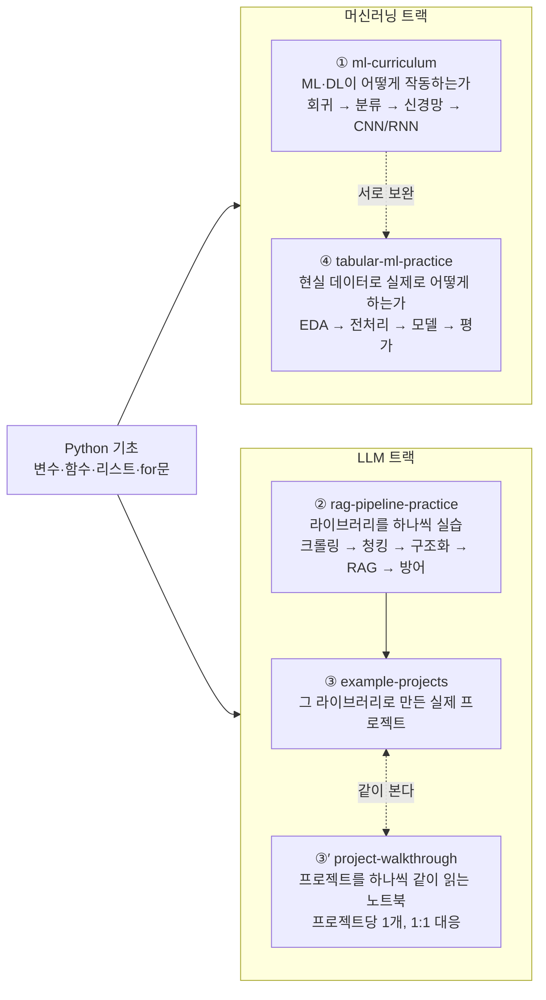

# ML 튜토리얼 프로젝트

Google Colab에서 실습하는 머신러닝/LLM 입문 튜토리얼 저장소입니다. 성격이 다른 네 종류의 콘텐츠로
구성되어 있습니다. 낯선 용어가 나오면 **[glossary.md](glossary.md)** (통합 용어집)에서,
에러가 나거나 결과가 예상과 다르면 **[troubleshooting.md](troubleshooting.md)** (막혔을 때 보는 문서)에서
찾아보세요. 설치 실패·한글 깨짐·`NameError`·API 키·GPU처럼 여러 노트북에서 반복되는 문제를 모아뒀습니다.

## 이 저장소는 누구를 위한 것인가요?

아래에 해당한다면 이 자료가 맞습니다.

- ✔ 파이썬 기초 문법(변수, 리스트/딕셔너리, `for`/`if`, 함수 정의)은 읽고 쓸 수 있다
- ✔ AI/머신러닝은 처음이거나, 용어만 들어봤다
- ✔ 논문이나 수학 증명보다 **돌아가는 코드**로 이해하고 싶다
- ✔ 설치 없이 Colab에서 바로 실습하고 싶다
- ✔ ChatGPT API나 RAG를 직접 써보고 싶다

**필요한 선수 지식은 파이썬 기초 문법까지입니다.** 클래스·데코레이터 같은 고급 문법은 몰라도 됩니다.
①의 이론 섹션에는 미분·행렬 수식이 나오지만, 수식을 못 읽어도 코드 실습과 결과 해석은 따라갈 수
있도록 되어 있습니다(대신 수식 자체를 처음부터 가르치지는 않습니다). NumPy/Pandas/PyTorch가
처음이라면 [`00_python_essentials`](notebooks/ml-curriculum/00_python_essentials/00_python_essentials.ipynb)부터
시작하세요. 파이썬 자체가 처음이라면 다른 파이썬 입문 자료를 먼저 보고 오시는 편이 빠릅니다.

## 무엇이 들어 있나요?

| 구분 | 위치 | 성격 |
|---|---|---|
| ① 이론 커리큘럼 | `notebooks/ml-curriculum/` | scikit-learn/PyTorch로 배우는 전통적인 머신러닝·딥러닝 입문 (이론 + 실습 + 연습문제) |
| ② 라이브러리 실습 | `notebooks/rag-pipeline-practice/` | 문서 기반 LLM 앱(크롤링→청킹→구조화→RAG→프롬프트 인젝션 방어)에 쓰이는 라이브러리를 Colab에서 손으로 익히는 실습 |
| ③ 실전 예제 | `example-projects/` | ②에서 익힌 라이브러리로 실제 동작하는 미니 프로젝트 4개를 이어붙인 파이프라인 |
| ③′ 프로젝트 동행 노트북 | `notebooks/project-walkthrough/` | ③의 프로젝트를 **하나씩 옆에 펼쳐놓고 같이 읽는** 노트북 (프로젝트당 1개) |
| ④ 정형 데이터 워크플로우 | `notebooks/tabular-ml-practice/` | 결측치·이상치·문자열이 섞인 **실제 표 데이터**로 EDA → 전처리 → 모델링 → 평가까지 하는 전 과정 |

①과 ④는 ②/③과 주제가 겹치지 않는 별도 커리큘럼입니다. ②와 ③은 같은 파이프라인(사내 규정 검색 챗봇)을
다루며, ②는 "라이브러리 하나씩 실습", ③은 "그 라이브러리들로 만든 실제 프로젝트"라는 관계입니다.

③′는 ②와 **같은 프로젝트를 다른 각도**로 봅니다. ②가 "기법별"(BeautifulSoup은 어떻게 쓰나)이라면,
③′는 "프로젝트별"(이 프로젝트는 왜 이렇게 짰나)입니다. 설명을 옮겨 적는 대신 **실제 프로젝트 파일을
열어서 import해 돌려보는** 방식이라 노트북과 코드가 어긋나지 않습니다.
PostgreSQL·OpenSearch·API 키 없이 Colab에서 전부 실행됩니다.

①과 ④는 서로를 보완합니다. **①이 "머신러닝이 어떻게 작동하는가"(경사 하강법·역전파를 직접 구현)라면,
④는 "현실의 데이터로 실제로 어떻게 하는가"**입니다. 순서는 상관없습니다.

## 전체 지도 — 지금 내가 어디를 배우는 건가요?



**두 트랙은 왜 나뉘어 있나요?** 둘은 사실 한 줄기입니다.

```
머신러닝 → 딥러닝 → Transformer → LLM(GPT 등) → RAG
   ①          ①         (범위 밖)      ②③          ②③
```

①에서 배우는 경사 하강법·역전파는 딥러닝의 기본기이고, 그 딥러닝을 아주 크게 키운 것이
Transformer 구조의 **LLM**(GPT 같은 모델)입니다. 그리고 그 LLM에게 회사 문서처럼 학습되지 않은 내용을
찾아서 물어보게 만드는 기법이 **RAG**(②③)입니다. 다만 "LLM을 직접 만드는 것"은 개인이 하기 어렵고
실무에서도 거의 하지 않기 때문에, 이 저장소는 **LLM 내부 구조(Transformer) 대신 이미 만들어진 LLM을
가져다 쓰는 법**(②③)을 다룹니다. 그래서 ①을 몰라도 ②③을 시작할 수 있고, 반대로 ①만 해도 됩니다.

## 학습 가이드 — 어떻게 진행하면 되나요?

**목표에 따라 시작 지점이 다릅니다.**

- **머신러닝/딥러닝을 처음부터 배우고 싶다** → `notebooks/ml-curriculum/` 00 → 01 → 02 … 순서대로.
  00번은 NumPy/Pandas/PyTorch 사전 준비라 익숙하면 건너뛰어도 되고, 01번은 이론 없이 전체 흐름만
  훑는 워밍업입니다. **이론은 02번부터 시작합니다.** 자세한 목차는 **[CURRICULUM.md](CURRICULUM.md)** 참고.
- **내 CSV 데이터로 예측 모델을 만들고 싶다, 실무에서 쓰는 순서를 알고 싶다**
  → `notebooks/tabular-ml-practice/` 01 → 02 → 03 → 04 순서대로.
  결측치·이상치 처리부터 모델 평가·데이터 누출 진단까지 다룹니다.
  자세한 내용은 **[시리즈 README](notebooks/tabular-ml-practice/README.md)** 참고.
- **LLM/RAG 앱을 만들 때 쓰는 라이브러리(크롤링, 청킹, 구조화 출력, 임베딩/벡터 검색, 프롬프트 인젝션 방어)를
  익히고 싶다, ML 기초는 필요 없다** → `notebooks/rag-pipeline-practice/` 01 → 02 → 03 → 04 → 05 순서대로.
  Colab에서 API 키나 Docker 없이도 끝까지 실행되도록 만들어져 있어 설치 걱정 없이 바로 시작할 수 있습니다.
- **동작하는 실전 코드/프로젝트 구조를 보고 싶다** → `example-projects/` 참고. 각 프로젝트는
  로컬 실행 시 PostgreSQL/OpenSearch(Docker)와 OpenAI API 키가 필요합니다.
- **그 프로젝트 코드를 누가 옆에서 같이 읽어줬으면 좋겠다** → `notebooks/project-walkthrough/` 01~04.
  프로젝트당 노트북 하나가 붙어서, 실제 소스를 열어 보여주고 함수를 직접 import해 돌려봅니다.
  **인프라도 API 키도 없이 Colab에서 전부 실행됩니다.**
  자세한 내용은 **[시리즈 README](notebooks/project-walkthrough/README.md)** 참고.

**전부 다 해보고 싶다면 이 순서를 추천합니다.**

1. `notebooks/rag-pipeline-practice/01~05` — Colab에서 설치 없이 개념과 라이브러리 사용법을 먼저 손에 익힙니다.
2. `notebooks/project-walkthrough/01~04` — 그 라이브러리로 만들어진 **실제 프로젝트를 한 줄씩 읽습니다.**
   여기까지도 설치가 필요 없습니다. 인프라를 띄우기 전에 코드부터 이해하는 단계입니다.
3. `example-projects/` — 같은 파이프라인을 실제 인프라(PostgreSQL, OpenSearch)와 진짜 API로 동작시켜봅니다.
   시작하기 전에 **[example-projects/README.md](example-projects/README.md)**의 파이프라인 다이어그램을
   먼저 읽으면 4개 프로젝트가 어떻게 이어지는지 한눈에 파악됩니다.
4. (선택) `notebooks/ml-curriculum/00~06` — ML/딥러닝 기초 이론까지 확장하고 싶을 때.
   `07_tensorflow_practice`는 02/04를 TensorFlow/Keras로 다시 풀어보는 보너스 실습이니 06까지
   끝낸 뒤 여유가 있을 때 봐도 됩니다.
5. (선택) `notebooks/tabular-ml-practice/00~04` — 실제 표 데이터를 다루는 전 과정.
   ①과 독립적이라 먼저 봐도 되고, ①을 끝낸 뒤 "그래서 실무에서는 어떻게 하나"로 이어봐도 됩니다.

각 단계 안에서도 `_solutions.ipynb`는 정답 코드이므로 먼저 혼자 풀어본 뒤에 열어보는 걸 권장합니다.
ml-curriculum 00~07, rag-pipeline-practice 01~05, project-walkthrough 01~04, tabular-ml-practice 01~04에 각각 해설 노트북이 있고,
`tabular-ml-practice/00_pandas_for_tabular`만 연습문제 없이 "필요할 때 찾아보는 pandas 문법 사전" 역할이라
해설 노트북이 없습니다.

## 바로 열기 (Colab 배지)

배지를 클릭하면 각 노트북이 Colab에서 바로 열립니다 (GitHub 저장소: [karzit/temp](https://github.com/karzit/temp)).

### ① ml-curriculum

| 노트북 | 열기 |
|---|---|
| 00. NumPy/Pandas/PyTorch 필수 라이브러리 | [](https://colab.research.google.com/github/karzit/temp/blob/master/notebooks/ml-curriculum/00_python_essentials/00_python_essentials.ipynb) |
| 01. 기본 분류 (scikit-learn) | [](https://colab.research.google.com/github/karzit/temp/blob/master/notebooks/ml-curriculum/01_basic_classification/01_basic_classification.ipynb) |
| 02. Linear Regression | [](https://colab.research.google.com/github/karzit/temp/blob/master/notebooks/ml-curriculum/02_linear_regression/02_linear_regression.ipynb) |
| 03. Classification | [](https://colab.research.google.com/github/karzit/temp/blob/master/notebooks/ml-curriculum/03_classification/03_classification.ipynb) |
| 04. Neural Networks | [](https://colab.research.google.com/github/karzit/temp/blob/master/notebooks/ml-curriculum/04_neural_networks/04_neural_networks.ipynb) |
| 05. CNN | [](https://colab.research.google.com/github/karzit/temp/blob/master/notebooks/ml-curriculum/05_cnn/05_cnn.ipynb) |
| 06. RNN | [](https://colab.research.google.com/github/karzit/temp/blob/master/notebooks/ml-curriculum/06_rnn/06_rnn.ipynb) |
| 07. TensorFlow/Keras 실습 (선택) | [](https://colab.research.google.com/github/karzit/temp/blob/master/notebooks/ml-curriculum/07_tensorflow_practice/07_tensorflow_practice.ipynb) |

### ② rag-pipeline-practice

| 노트북 | 열기 |
|---|---|
| 01. 웹 크롤링 (requests + BeautifulSoup) | [](https://colab.research.google.com/github/karzit/temp/blob/master/notebooks/rag-pipeline-practice/01_web_crawling/01_web_crawling.ipynb) |
| 02. 텍스트 청킹 & PDF 처리 | [](https://colab.research.google.com/github/karzit/temp/blob/master/notebooks/rag-pipeline-practice/02_text_chunking/02_text_chunking.ipynb) |
| 03. 문서 구조화 (Pydantic + OpenAI) | [](https://colab.research.google.com/github/karzit/temp/blob/master/notebooks/rag-pipeline-practice/03_document_structuring/03_document_structuring.ipynb) |
| 04. RAG 파이프라인 | [](https://colab.research.google.com/github/karzit/temp/blob/master/notebooks/rag-pipeline-practice/04_rag_pipeline/04_rag_pipeline.ipynb) |
| 05. 프롬프트 인젝션/탈옥 방어 | [](https://colab.research.google.com/github/karzit/temp/blob/master/notebooks/rag-pipeline-practice/05_prompt_injection_defense/05_prompt_injection_defense.ipynb) |

### ③′ project-walkthrough (프로젝트 동행)

예제 프로젝트를 옆에 펼쳐놓고 같이 읽는 노트북입니다. 인프라·API 키 없이 실행됩니다.

| 노트북 | 열기 |
|---|---|
| 01. `crawl-storage-example` 동행 | [](https://colab.research.google.com/github/karzit/temp/blob/master/notebooks/project-walkthrough/01_crawl_storage/01_crawl_storage.ipynb) |
| 02. `preprocess-example` 동행 | [](https://colab.research.google.com/github/karzit/temp/blob/master/notebooks/project-walkthrough/02_preprocess/02_preprocess.ipynb) |
| 03. `document-input-example` 동행 | [](https://colab.research.google.com/github/karzit/temp/blob/master/notebooks/project-walkthrough/03_document_input/03_document_input.ipynb) |
| 04. `rag-regulation-example` 동행 | [](https://colab.research.google.com/github/karzit/temp/blob/master/notebooks/project-walkthrough/04_rag_regulation/04_rag_regulation.ipynb) |

### ④ tabular-ml-practice

| 노트북 | 열기 |
|---|---|
| 00. 이 시리즈에서 쓰는 pandas 문법 | [](https://colab.research.google.com/github/karzit/temp/blob/master/notebooks/tabular-ml-practice/00_pandas_for_tabular/00_pandas_for_tabular.ipynb) |
| 01. 데이터 탐색과 시각화 | [](https://colab.research.google.com/github/karzit/temp/blob/master/notebooks/tabular-ml-practice/01_eda_visualization/01_eda_visualization.ipynb) |
| 02. 전처리 (이상치·결측치·인코딩·스케일링) | [](https://colab.research.google.com/github/karzit/temp/blob/master/notebooks/tabular-ml-practice/02_preprocessing/02_preprocessing.ipynb) |
| 03. 트리 모델과 평가 | [](https://colab.research.google.com/github/karzit/temp/blob/master/notebooks/tabular-ml-practice/03_tree_models/03_tree_models.ipynb) |
| 04. 신경망 (Keras) | [](https://colab.research.google.com/github/karzit/temp/blob/master/notebooks/tabular-ml-practice/04_dnn_keras/04_dnn_keras.ipynb) |

## 폴더 구조 (각 폴더에는 무엇이 있나요)

```
notebooks/
  NOTEBOOK_STYLE.md             (집필자용) 노트북을 새로 쓰거나 고칠 때 지키는 서술 규칙 — 학습자는 안 봐도 됨
  ml-curriculum/                이론 커리큘럼 (①) — scikit-learn/PyTorch
    00_python_essentials/       NumPy/Pandas/PyTorch 필수 라이브러리 실습 (사전 준비, 건너뛰어도 됨)
    01_basic_classification/    scikit-learn 파이프라인 입문
    02_linear_regression/       Lec 1-4: Linear Regression
    03_classification/          Lec 5-6: Logistic/Softmax Regression
    04_neural_networks/         Lec 7-10: 실전 팁, XOR, ReLU, Dropout, MNIST
    05_cnn/                     Lec 11: CNN
    06_rnn/                     Lec 12: RNN
    07_tensorflow_practice/     (선택) TensorFlow/Keras 라이브러리 실습 — 02/04의 PyTorch 예제를 TF로 재구현
  rag-pipeline-practice/        라이브러리 실습 (②) — example-projects와 1:1 대응
    01_web_crawling/            requests + BeautifulSoup 크롤링, sqlite3/dotenv 실습 (crawl-storage-example)
    02_text_chunking/           langchain-text-splitters, PyMuPDF/pypdf, tiktoken 실습 (preprocess/rag-regulation-example)
    03_document_structuring/    Pydantic + OpenAI 정형 출력, Streamlit 실습 (document-input-example)
    04_rag_pipeline/            임베딩, 벡터 유사도 검색, opensearch-py, 프롬프트 조립 실습 (rag-regulation-example)
    05_prompt_injection_defense/ 프롬프트 인젝션/탈옥 재현과 방어(데이터·지시 분리, 입력 가드레일) 실습 (rag-regulation-example 확장)
  project-walkthrough/          프로젝트 동행 노트북 (③′) — example-projects와 1:1, 실제 소스를 열어 함께 읽음
    01_crawl_storage/           crawl-storage-example 읽기 — 원본 보관, UPSERT, 실패 격리
    02_preprocess/              preprocess-example 읽기 — 형식 통일, 정제, 청킹, 형태소 키워드
    03_document_input/          document-input-example 읽기 — 정형 출력, 스키마 검증, fail fast
    04_rag_regulation/          rag-regulation-example 읽기 — 구조 파싱, 조항 청킹, 리랭킹, 평가 하네스
  tabular-ml-practice/          정형 데이터 워크플로우 (④) — 자세한 내용은 notebooks/tabular-ml-practice/README.md
    00_pandas_for_tabular/      01~04번에 나오는 pandas 문법만 모은 사전 (연습문제 없음, 필요할 때 찾아보기)
    01_eda_visualization/       info/describe로 문제 찾기, 그래프 선택 기준, 데이터 누출 감지
    02_preprocessing/           이상치(IQR), 결측치, 원-핫 인코딩, train_test_split, 스케일러 3종
    03_tree_models/             결정 트리·랜덤 포레스트, 평가 지표, 교차검증, GridSearchCV, 변수중요도
    04_dnn_keras/               Keras 신경망, 학습 곡선 진단, EarlyStopping/Dropout, 트리 모델과 비교

example-projects/               실전 예제 (③) — 자세한 내용은 example-projects/README.md
  crawl-storage-example/        [A-1] 웹 크롤링 -> PostgreSQL 원본 저장
  preprocess-example/           [A-2] PostgreSQL 원본 -> 청킹 -> OpenSearch 인덱싱
  document-input-example/       [B]   서류 사진 -> OCR -> LLM 정형 출력(JSON), Streamlit UI
  rag-regulation-example/       [C]   PDF 구조 파싱 -> 조항 청킹 -> 하이브리드 검색·리랭킹
                                      -> LLM 응답(RAG) -> 검색 품질 평가(hit@5/MRR)

frozen-lake-viz/   ①과 무관한 별도 보조 자료 — Q-Learning(RL)을 브라우저에서 바로 보는 시각화 데모.
                   RL은 ml-curriculum 범위 밖이라 정식 노트북은 없고, 그 자리를 미리 맛보는 자료입니다.
                   설치 없이 index.html만 열면 됩니다 (자세한 내용은 frozen-lake-viz/README.md).
data/          MNIST처럼 여러 노트북이 나눠 쓰는 데이터셋 캐시 (git에는 커밋 안 됨)
               노트북이 자기 실습 결과로 만드는 파일은 여기가 아니라 노트북 옆에 생깁니다
CURRICULUM.md  ①의 이론+실습 목차 (원본 강의 매핑 포함)
glossary.md    전체 통합 용어집 (①②③④ 공통)
troubleshooting.md  막혔을 때 보는 문서 — 설치·한글 깨짐·NameError·API 키·Docker·GPU (①②③④ 공통)
requirements.txt
```

각 노트북은 `notebooks/<시리즈>/<주제>/`처럼 시리즈별 하위 폴더에 있습니다.

노트북이 만드는 파일(CSV, 저장한 모델)은 **노트북과 같은 폴더의 `data/`, `models/`**에 생깁니다.
Colab에서 노트북 하나만 열든 저장소를 통째로 받아 쓰든 똑같이 동작합니다. 예외는 MNIST로,
네 개 노트북이 같은 64MB를 다시 받지 않도록 프로젝트 루트의 `data/`를 `../../../data`로
함께 씁니다.

반면 노트북 **본문의 링크**(용어집·트러블슈팅·예제 프로젝트·다른 노트북)는 상대 경로가 아니라
절대 URL을 씁니다. Colab 배지로 노트북 하나만 열면 그 런타임에는 저장소가 없어서 상대 링크가
전부 깨지기 때문입니다. 새 노트북을 쓸 때 지켜야 할 규칙은 `notebooks/NOTEBOOK_STYLE.md`에
정리돼 있습니다.

`tabular-ml-practice`는 데이터를 파일로 두지 않고 seaborn 내장 데이터셋(`taxis`, `titanic`)을
그때그때 내려받으므로 `data/`에 아무것도 준비할 필요가 없습니다.

## Colab에서 열기

**방법 A — 배지 클릭 (가장 쉬움)**
위 표의 배지를 클릭하면 바로 Colab에서 열립니다.

**방법 B — GitHub 탭에서 직접 탐색**
1. [colab.research.google.com](https://colab.research.google.com) 접속
2. 파일 → GitHub 탭 → 저장소 `karzit/temp` 입력 → 노트북 선택
3. Colab에서 수정한 내용은 "GitHub에 사본 저장"으로 다시 push 가능

**방법 C — Google Drive**
1. 이 프로젝트 폴더를 Google Drive에 업로드
2. 노트북 첫 코드 셀에서 `drive.mount('/content/drive')` 주석 해제 후 실행

## 로컬에서 실행하려면

```bash
pip install -r requirements.txt
jupyter notebook notebooks/ml-curriculum/01_basic_classification/01_basic_classification.ipynb
```

`example-projects/`의 각 프로젝트는 별도의 `requirements.txt`와 `.env.example`을 가지고 있고,
`crawl-storage-example`/`preprocess-example`/`rag-regulation-example`은 PostgreSQL 또는 OpenSearch를
Docker로 띄워야 합니다. 실행 방법은 각 프로젝트 폴더의 `README.md`를 참고하세요.

## 다음 튜토리얼 아이디어
- PyTorch로 이미지 분류 (CNN, MNIST/CIFAR-10)
- Hugging Face Transformers로 텍스트 분류
- 자신의 CSV 데이터셋으로 파이프라인 재사용
- `example-projects/` 4개를 실제로 이어서 실행하는 통합 데모 스크립트/가이드
